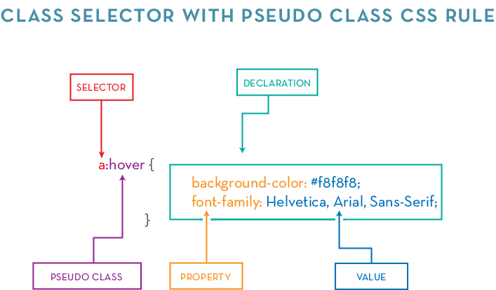
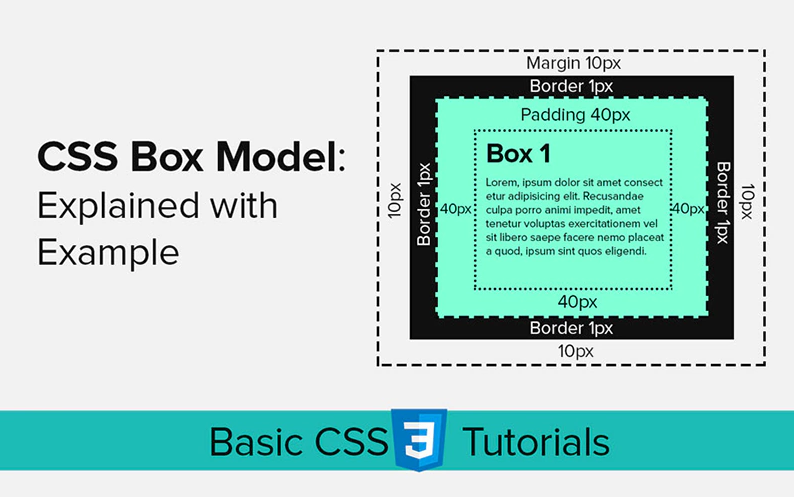

# 2 DAY CSS (06-08-2023)

## Contents

## What is CSS?
- CSS stands for Cascading Style Sheet
- CSS is used to style an HTML document
- CSS can also dictate how HTML elements should be displayed
- Not a programming language

## Prerequisite and Reminder
- You need to know HTML
- You need to be a little artistic
- Every developer has its own way of using CSS

## Types of CSS
### Inline CSS
- Uses the style attribute inside the HTML elements. (not recommended)
```html
<h1 style="color: blue">CSS Introduction</h1>
```
### Internal CSS
- Uses the <style> element inside the <head> of the HTML page.
 ```html
<head>
  <style type="text/css">
    h1 {
        color: green;
    }
  </style>
</head>
<body>
  <h1>CSS Introduction</h1>
</body>
```
### External CSS
- Uses an external CSS file which is linked by the <link> element inside the <head> of the HTML page.
 #### HTML file
 ```html
 <head>
  <link rel="stylesheet" href="css/style.css">
</head>
 ```
 #### CSS file
 ```css
body {
   font-family: 'Lato', sans-serif;
}
 ```
 
## ID vs Class: Targeting and Usage

In CSS, both IDs and classes are used for targeting specific elements, but they have distinct characteristics and purposes. Here's a comparison of IDs and classes, along with examples of how to target them:

### ID Selector

- Represents a unique identifier for an element.
- Denoted by the `#` symbol followed by the ID name.

Example:
```css
#my-id {
  /* Styles applied to the element with ID 'my-id' */
}
 ```
 
### Class Selector
- Represents a group or category of elements. Denoted by a dot (.) followed by the class name.
 
Example:
```css
.my-class {
  /* Styles applied to all elements with the class 'my-class' */
}
```
> To target an element by ID, use the ID selector with the corresponding ID name. For example, if you have an element with the ID of my-id, you can target it using #my-id in your CSS.
>
> To target elements by class, use the class selector with the corresponding class name. For example, if you have multiple elements with the class of my-class, you can target them using .my-class in your CSS.
>
> Remember to replace my-id and my-class with the actual ID and class names used in your HTML code.


 
## CSS Anatomy
> Knowing about CSS anatomy is important because it provides a structured understanding of the different components and terminology used in CSS. Understanding the roles and relationships between selectors, pseudo-?
> classes, declarations, property names, and property values helps in writing more efficient and targeted CSS code. It allows developers to style specific elements, apply different styles based on element states, and 
> control various aspects of element appearance and behavior.
 
 
 
 | Term            | Description                                                     |
|-----------------|-----------------------------------------------------------------|
| Selector        | Specifies which HTML elements the CSS rules will be applied to.  |
| Pseudo Class    | Represents a specific state or condition of an element.          |
| Declaration     | Consists of a property name and value, separated by a colon.     |
| Property Name   | Identifies the specific CSS property to be modified.             |
| Property Value  | Specifies the desired value for the corresponding property.      |
 
 
## What is CSS Selector

CSS Selector is a pattern used to select and style specific elements on a web page. Selectors allow you to target elements based on their attributes, types, classes, or relationships with other elements.

There are five categories of CSS selectors:

| Category          | Function and Example                                               |
|-------------------|-------------------------------------------------------------------|
| Type Selector     | Targets elements based on their element type.                     |
| Class Selector    | Targets elements based on their class attribute.                  |
| ID Selector       | Targets elements based on their ID attribute.                     |
| Attribute Selector | Targets elements based on their attribute values.                 |
| Pseudo-class Selector | Targets elements based on special states or conditions.           |

### Type Selector
Type selector targets elements based on their element type.

Example: Select all `<h1>` elements on the page.
```css
h1 {
  color: red;
}
### Class Selector
Class selector targets elements based on their class attribute.

Example: Select all elements with the class "highlight".
```css
 .highlight {
  background-color: yellow;
}
```
### ID Selector
ID selector targets elements based on their ID attribute.

Example: Select the element with the ID "logo".
```css
 #logo {
  width: 100px;
}
```
### Attribute Selector
Attribute selector targets elements based on their attribute values.

Example: Select all elements with the attribute "target" set to "_blank".
 ```css
 [target="_blank"] {
  text-decoration: underline;
}
```
### Pseudo-class Selector
Pseudo-class selector targets elements based on special states or conditions.

Example: Select the first child of an element.
```css
 :first-child {
  font-weight: bold;
}
```
## CSS Combinators

A combinator is something that explains the relationship between the selectors.

A CSS selector can contain more than one simple selector. Between the simple selectors, we can include a combinator.

There are four different combinators in CSS:
 
### CSS Combinators

A combinator is something that explains the relationship between the selectors. A CSS selector can contain more than one simple selector. Between the simple selectors, we can include a combinator.

There are four different combinators in CSS:

| Combinator              | Description                                            | Example                                          |
|-------------------------|--------------------------------------------------------|--------------------------------------------------|
| Descendant Selector     | Matches all elements that are descendants of a specified element. | `div p` { background-color: yellow; }           |
| Child Selector          | Selects all elements that are the children of a specified element. | `parent > child` { /* CSS rules */ }            |
| Adjacent Sibling Selector | Selects an element that is directly after another specific element. | `element + sibling` { /* CSS rules */ }         |
| General Sibling Selector | Selects all elements that are next siblings of a specified element. | `element ~ sibling` { /* CSS rules */ }         |



 
 ### How to Comment
 ```css
 /* This is a comment */
 ```
 
 ### The Root Selector
 ```css
 * {
   font-size: 20px;
}
 ```
 ### Ways to set a color
 ```css
 /* Color Name */
 h1 {
   color: red;
}
/* Hexadecimal */
 h1 {
   color: #ff0000;
}
/* RGB */
 h1 {
   color: rgb(255, 255, 0);
}
```


